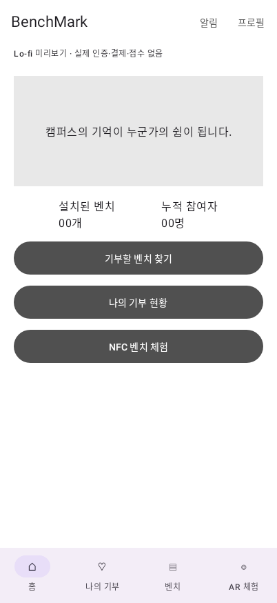
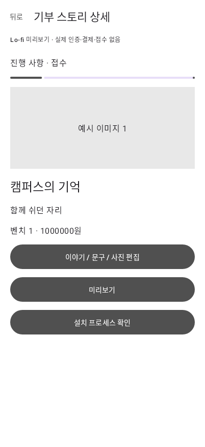
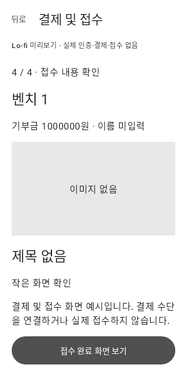
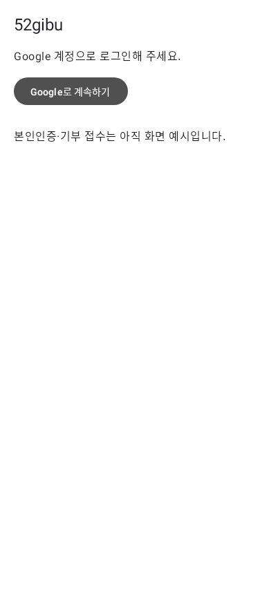

# BenchMark Android

Kotlin + Jetpack Compose 기반 앱입니다. 기부 화면은 lo-fi 흐름 확인용이고 AR 화면은 실제 카메라·3D 촬영을 제공합니다. Android Studio에서 이 디렉터리(`apps/android`)를 엽니다. 기존 웹의 빌드·배포와 독립되어 있습니다.

## 실행

- JDK 21, Android SDK Platform 36, Android Build Tools 35.0.0
- Gradle 8.14 / AGP 8.10.1 / Kotlin 및 Compose Compiler 2.1.20
- 최소 Android 8.0(API 26), target/compile API 36
- 로컬 확인용 application ID: `kr.ac.postech.benchmark.lofi` (배포용 식별자 아님)
- Android Studio의 **Gradle JDK**를 21로 지정합니다. 설치된 Studio의 bundled JDK 25는 이 Gradle 버전과 맞지 않습니다.
- SDK 위치는 Studio가 생성하는 `local.properties` 또는 `ANDROID_HOME`으로 지정합니다. 로컬 경로는 Git에 넣지 않습니다.

```bash
cd apps/android
./gradlew --no-daemon assembleDebug
./gradlew --no-daemon testDebugUnitTest lintDebug
```

Android Studio에서 `app`을 선택하고 기기 또는 에뮬레이터로 Run합니다. APK는 `app/build/outputs/apk/debug/app-debug.apk`에 생성됩니다.

## Google 로그인 설정

현재 Android 구현과 Supabase 콜백 등록은 준비되어 있습니다. **Needs confirmation:** 지정한 Google 계정의 재인증, OAuth 클라이언트 생성과 Supabase Google 제공자 활성화, 실제 계정 로그인은 아직 완료되지 않았습니다.

Supabase 프로젝트 `52gibu` (`kfzfzarslqdqmrazohej`)를 사용합니다. Google Cloud 프로젝트와 OAuth 설정은 프로젝트 운영 계정에서 관리합니다.

1. Google Auth Platform에서 앱 이름 `52gibu`, 기본 `openid`, `email`, `profile` 범위로 OAuth를 구성합니다. 웹 애플리케이션 클라이언트의 승인된 리디렉션 URI는 `https://kfzfzarslqdqmrazohej.supabase.co/auth/v1/callback`입니다.
2. Supabase Authentication → Google에 해당 Client ID와 Client Secret을 설정합니다. Client Secret은 앱·Git에 넣지 않습니다.
3. Supabase URL Configuration의 허용 목록에 `kr.ac.postech.benchmark://auth/callback`을 추가합니다.
4. Supabase **publishable key**를 환경 변수 `SUPABASE_PUBLISHABLE_KEY` 또는 Git에서 제외된 `apps/android/local.properties`의 같은 이름 속성으로 제공하고 다시 빌드합니다. `service_role` 또는 secret key를 사용하지 않습니다.

키가 없으면 Google 로그인 버튼이 비활성화됩니다. 예시 로그인으로 우회하지 않습니다. Google OAuth가 테스트 상태이면 허용한 테스트 계정만 사용할 수 있습니다. 공개 배포 전에는 동의 화면·도메인 및 게시 상태를 확인해야 합니다.

로그인은 외부 브라우저에서 진행하며 PKCE 검증자가 있는 요청만 콜백으로 교환합니다. 로그인 요청은 15분 뒤 만료됩니다. 브라우저에서 취소한 경우 앱의 `로그인 취소`를 누르고 재시도합니다. 세션과 PKCE 검증자는 Android Keystore 키로 암호화한 앱 전용 저장소에 보관하며 백업하지 않습니다. 프로필의 `로그아웃`은 로컬 세션과 현재 계정의 기부 예시 상태를 지웁니다. 네트워크 오류 시 원격 로그아웃을 확인할 수 없어도 로컬 세션을 지웁니다.

기부자 입력과 기부 내역은 여전히 로컬 예시입니다. Google 로그인 성공 시 서버의 기존 Auth 트리거가 `public.users` 기본 행을 만들지만, 예시 기부자 정보는 해당 행으로 저장하지 않습니다.

## 범위

[Figma Lofi 504:1861](https://www.figma.com/design/nEDJaJBFrdzBCa1WcgADHH/BenchMark?node-id=504-1861)의 화면 구성과 흐름을 구현했습니다. 디자인 고도화 요청이 아니므로 기본 Material 컴포넌트와 회색 이미지·지도 영역을 사용합니다. 원본 iPhone 시스템 바 및 iOS 권한 팝업은 Android에 복제하지 않습니다.

- Google 로그인 → 기부자 정보 입력 여부 → 입력/본인인증 예시 → 홈
- 홈 → 벤치 위치 → 벤치 선택 → 기부 안내 → 약관 → 인증 예시 → 금액 → 인적사항 → 스토리/이미지 → 접수 예시
- 나의 기부 → 빈 상태 또는 예시 내역 → 상세 → 편집/미리보기 → 진행 사항 → 설치 결과
- NFC 예시 → 기부자의 이야기 → 실제 AR 카메라 → 바닥 배치 → 사진 / 음성 포함 영상 촬영·저장·공유
- 홈·나의 기부·벤치·AR 체험 탭, 프로필, 알림 빈 화면

Google 로그인은 Supabase Auth에 연결합니다. 본인인증, 결제, 기부 API/데이터베이스, 지도 SDK, NFC, 위치 서비스는 연결하지 않습니다. AR 카메라와 촬영은 실제 기능입니다. 카메라 및 영상 촬영 시 마이크 권한을 요청하며 위치 권한은 요청하지 않습니다. 최소금액 100만원과 3년 기한은 lo-fi의 문구를 재현한 예시이며 실제 운영 정책 확정이 아닙니다. Apple 로그인은 구현하지 않습니다.

## 화면 대응

| Figma node | 화면 |
| --- | --- |
| 504:2166, 504:2176 | 로그인, 정보 입력 여부 |
| 510:2193, 510:2194 | 기부자 정보, 인증 |
| 505:524, 505:531 | 홈 변형을 한 홈 화면으로 통합 |
| 514:2370, 514:2336 | 벤치 목록/위치, 선택 |
| 514:2362, 514:2401 | 기부 설명, 약관/인증 |
| 514:2400, 515:2424 | 기부금, 인적사항 |
| 515:2481, 515:2497 | 스토리 작성, 접수 |
| 513:717, 513:773, 515:2502, 515:2501 | 기부 빈 상태/내역/편집/설치 결과 |
| 510:2306, 510:2316, 510:2329 | NFC, 이야기, AR |

사진 선택·접수 내용 확인·진행 단계는 원본 흐름도에 있고 상세 프레임이 없는 화면입니다. 기본 컨트롤로 흐름만 보완했습니다. 프로필은 기존 기부자 입력 화면을 재사용하며 알림은 빈 상태입니다. 진행 단계 이름은 6단계 도형을 설명하기 위한 예시입니다.

## 상태와 내비게이션

- `BenchmarkApp.kt`: 단일 `NavHost`, 화면 연결, 탭과 뒤로가기
- `LofiState.kt`: `SavedStateHandle`을 사용하는 화면 예시 상태
- `DonationScreens.kt`: 기부 및 내역 화면
- `auth/`: Google PKCE 로그인, 세션 상태와 Android Keystore 암호화 저장
- `MainActivity.kt`: 로그인 세션에 따른 앱 진입과 콜백 수신
- `ExperienceScreens.kt`: 본인인증 예시 및 AR 진입 안내
- `ar/`: 실제 AR 세션·캐릭터·조명·촬영·저장
- `Components.kt`: 공통 입력/스크롤/회색 영역

입력값은 뒤로가기와 Activity 재생성에서 유지됩니다. 편집본과 저장본을 분리하여 취소 시 원본을 보존합니다. 접수 후 입력 단계는 백스택에서 제거합니다. 탭 이동은 홈을 기준으로 정리해 중복 누적을 막습니다. 예시 상태는 서버나 영구 저장소에 저장하지 않으며 프로필의 초기화 버튼으로 제거할 수 있습니다. 주민등록번호 입력은 비활성 영역만 표시합니다.

402×874 원본의 정보 순서를 유지하되 고정 화면 크기를 강제하지 않습니다. 시스템 영역과 키보드 inset을 처리하고 내용은 스크롤됩니다. 원본에 없는 세밀한 스타일은 기본값을 사용합니다.

## 자동 검증

`NavigationTest`는 Robolectric API 35 환경에서 실제 Compose 화면을 클릭합니다. 온보딩 건너뛰기/입력, 금액·약관 조건, 사진 선택/거부, 접수 백스택, 편집 취소/저장, Activity 재생성, 탭 반복, AR 진입·복귀, 320dp 화면의 이동을 검증합니다.

테스트 화면 캡처는 `app/build/lofi-screenshots/`에 생성합니다. 이는 기기나 에뮬레이터 캡처가 아닌 Robolectric의 화면 렌더링입니다. 실기기의 키보드, 시스템 뒤로가기 제스처 및 접근성 서비스 확인은 별도입니다.

버전 호환 근거: [AGP 8.10](https://developer.android.com/build/releases/agp-8-10-0-release-notes), [Kotlin Compose Compiler 설정](https://kotlinlang.org/docs/compose-compiler-migration-guide.html).

## 초기 lo-fi 구현 검증 결과 (AR 통합 전)

2026-09-30, macOS arm64 / Microsoft OpenJDK 21.0.7에서 실행했습니다.

```bash
JAVA_HOME='/Users/don/Library/Java/JavaVirtualMachines/ms-21.0.7/Contents/Home' ANDROID_HOME='/Users/don/Library/Android/sdk' ./gradlew --no-daemon assembleDebug testDebugUnitTest lintDebug
```

- 최종 실행: 성공, 테스트 6개 통과, 실패/스킵 0
- lint: 오류 0, 경고 8 (라이브러리/Gradle 최신 버전 안내 6, 백업 규칙 권고 1, 앱 아이콘 미지정 1)
- 화면: 402×874와 320×640 오프스크린 렌더링 확인
- 실기기/에뮬레이터 실행, 실제 키보드 및 시스템 제스처: 미검증
- 첫 캡처 API의 Robolectric 타임아웃은 View/Canvas 렌더링으로 수정했고, API 27 전용 스타일 속성은 제거해 최소 API 26 선언에 맞췄습니다.

| 홈 | 기부 상세 | 작은 화면 |
| --- | --- | --- |
|  |  |  |

이미지는 Robolectric 테스트 캡처이며 실제 기기 캡처가 아닙니다.


## 실제 AR 실행

Android Studio에서 `apps/android`를 열고 Gradle JDK 21로 Sync한 후 `app`을 실행합니다. Google 로그인 → 건너뛰기 → AR 체험 탭 → 태그 결과 예시 → AR 카메라 열기 → AR 카메라 시작으로 들어갑니다.

1. [ARCore 지원 실제 Android 기기](https://developers.google.com/ar/devices)를 USB로 연결하고 실행합니다.
2. 카메라 권한을 허용합니다. 필요하면 Google Play Services for AR 설치/업데이트가 안내됩니다.
3. 바닥을 천천히 비추고 인식된 평면을 터치합니다. 캐릭터를 바꾸거나 위치를 잠글 수 있습니다.
4. 배치·조명 조절에서 키·회전·바닥 높이, 환경 조명·밝기 보정·바닥 그림자·Depth·수동 광원을 변경합니다.
5. `넙죽이 · 애니메이션`을 선택하고 동작을 누르면 반복 재생됩니다. 일시정지/계속 재생을 지원합니다.
6. 사진 촬영 또는 영상 + 음성을 누릅니다. 영상은 마이크 권한이 필요하며 최대 60초, 최대 긴 변 1280px, 30fps 설정입니다. 실제 프레임률은 기기에 따라 다릅니다.
7. 저장은 Android 10 이상에서 갤러리, Android 8~9에서 시스템 파일 저장 화면을 사용합니다. 공유는 미디어와 촬영 설정 JSON을 함께 전달합니다.

AR은 선택 기능이므로 비지원 기기에서도 나머지 앱 화면은 사용할 수 있습니다. 에뮬레이터는 화면과 모델 렌더링 검증에 활용하며 실제 바닥 추적·사람 가림·마이크 품질을 대신 검증하지 않습니다.

### 구현과 플랫폼 차이

- 참조: [ARTest 704ea94](https://github.com/june6-6/ARTest/tree/704ea94bf76dbafd77d90f1645154a71ca19cb4c). 원본 Swift 코드를 직접 실행하는 방식이 아닌 Kotlin 재구현입니다.
- SceneView 2.3.0 / ARCore 1.48.0 / Filament 1.56.0: 기존 Kotlin 2.1.20·Compose 환경과 호환되는 고정 버전입니다. SceneView는 렌더러·모델·깊이 재질에 사용하며 AR 세션 수명과 정리는 앱에서 소유합니다.
- 수평 평면 내부의 Hit Test만 배치에 사용합니다. 위치 잠금은 현재 세션 내 잠금이며 재실행 후 같은 장소를 복원하는 Cloud/Geospatial Anchor 기능이 아닙니다.
- 깊이 지원 여부는 현재 세션에서 확인합니다. 실제 물체·사람의 가림은 Depth 데이터에 의존하며 ARKit 사람 전용 segmentation 또는 LiDAR 메시와 동일하지 않습니다.
- 환경 HDR 조명과 수동 방향성 보조광, 감지한 평면의 그림자를 사용합니다. 실제 태양 방향 측정이나 현실 인체와의 상호 그림자는 구현하지 않습니다.
- USDZ 5개를 GLB로 변환했습니다. [에셋 출처·변환 기록](app/src/main/assets/models/README.md)을 확인하세요. 정적 메시 축소로 원본과 미세한 형상 차이가 있을 수 있습니다.
- 모델 교체 시 이전 GPU 리소스를 해제합니다. 애니메이션의 시간은 백그라운드에서 흐르지 않습니다. 화면 회전/Activity 재생성 시 조절값과 마지막 촬영 결과는 복원하지만 공간 배치는 새 세션에서 다시 합니다.
- 사진은 AR Surface의 PixelCopy, 영상은 같은 Surface를 MediaRecorder 입력으로 복사합니다. 앱 UI는 촬영에 포함하지 않습니다. 기본 카메라 앱의 4K/HDR 촬영 품질을 의미하지 않습니다.
- 녹화 중 설정·배치 변경을 차단하고 방향을 잠급니다. 60초 경과, 화면 크기 변경, 추적 중단, 백그라운드 진입 시 녹화를 종료합니다. 불완전한 녹화는 성공으로 표시하지 않습니다.
- 미디어 및 JSON은 앱 내부 `files/captures/`에 보관합니다. 사용자가 저장/공유를 요청할 때 외부로 내보냅니다. 앱 데이터 삭제 또는 앱 제거 시 내부 원본도 삭제됩니다. 이전 촬영 파일은 자동 삭제하지 않습니다.
- JSON은 촬영 요청 시 설정 스냅샷이며 센서 프레임과 엄밀히 동기화된 측정 자료가 아닙니다.

### 검증 명령

```bash
python3 tools/check_ar_models.py
./gradlew --no-daemon assembleDebug testDebugUnitTest lintDebug
# 실행 중인 격리된 에뮬레이터/테스트 기기가 있을 때:
./gradlew --no-daemon connectedDebugAndroidTest
```

`ArModelRenderTest`는 AR 렌더러 자원 생성·해제와 Android GPU의 5개 GLB 로딩·애니메이션 적용·PixelCopy·영상/오디오 트랙 생성을 확인합니다. 캡처는 테스트 기기 내부 `files/ar-verification/`에 생성됩니다. 실제 카메라 AR 합성 캡처가 아닙니다. 실기기 인수 항목은 [AR 검증표](../../docs/android-ar-validation.md)를 사용합니다.

## Google 로그인 구현 검증 (2026-10-07)

```bash
JAVA_HOME='/Users/don/Library/Java/JavaVirtualMachines/ms-21.0.7/Contents/Home' ANDROID_HOME='/Users/don/Library/Android/sdk' ./gradlew --no-daemon assembleDebug testDebugUnitTest lintDebug
```

- APK 빌드 성공, 단위·Compose 테스트 22개 통과(실패/스킵 0), lint 오류 0·경고 19.
- PKCE 표준 벡터, 잘못된 콜백·재전송·만료·취소·통신 실패, 세션 복원, 계정 변경, 로그아웃 후 초안 제거와 기존 화면 이동을 검증했습니다.
- 테스트 인증 서비스는 `src/test`에만 있으며 APK에 포함되지 않습니다. 테스트 통과는 실제 Google 계정 로그인이나 기기 Keystore 동작의 증거가 아닙니다.
- 실제 Google OAuth 설정 완료·계정 로그인·기기에서의 암호화 저장 복원은 미검증입니다.


