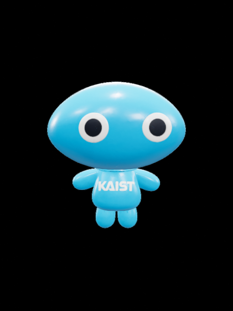
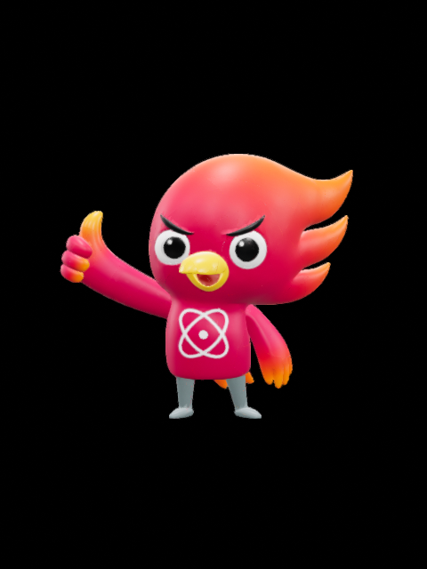
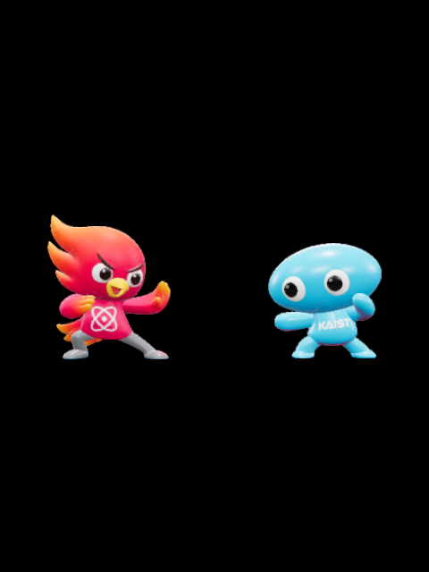
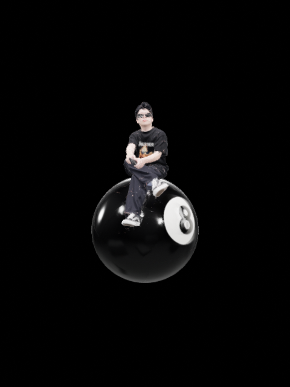
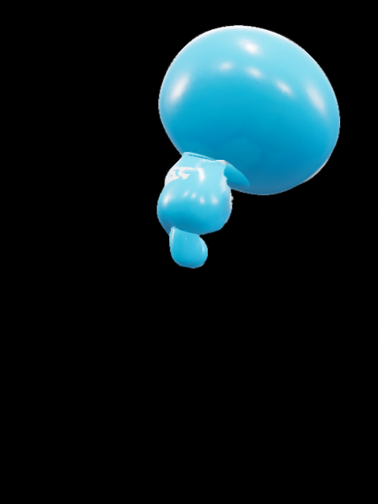
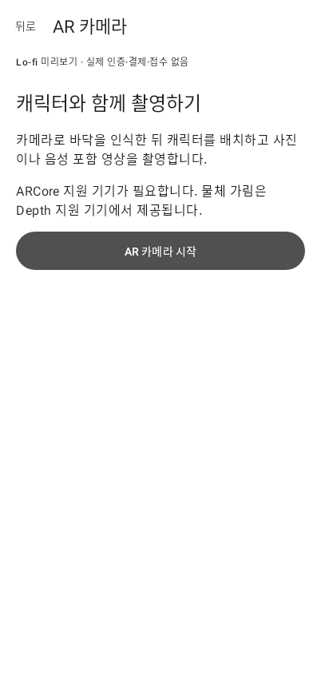

# Android AR 인수 검증

## 구현 범위

ARTest `704ea94bf76dbafd77d90f1645154a71ca19cb4c`의 캐릭터 배치·조명·애니메이션·사진·음성 포함 영상 흐름을 Kotlin으로 옮겼습니다. 원본의 LiDAR 메시/사람 전용 깊이 분할은 ARCore Depth 기반 가림으로 대체합니다. NFC 태그 및 기부 관련 서버 기능은 기존 lo-fi 범위입니다.

## 자동 검증과 실제 기기 경계

- GLB 내부 텍스처, 크기·해시, 애니메이션/뼈대 구조 검사
- 단위 검증: 모델 높이 정규화, 광원 방향, 애니메이션 일시정지·백그라운드 복귀, 영상 인코딩 크기
- UI 검증: 기존 기부 흐름, AR 진입·복귀, 작은 화면 권한 거부 안내의 재시도·설정·돌아가기
- 파일 검증: JPEG·JSON 생성과 범위가 제한된 FileProvider 공유
- Android GPU 검증: 5개 모델 로드, 애니메이션 적용, 렌더링 결과 PixelCopy

Needs confirmation: 아래 실기기 항목은 연결된 실제 Android 기기가 없어 미검증입니다. 자동 테스트/에뮬레이터 통과는 이 항목들의 통과를 의미하지 않습니다.

## 실제 기기 체크리스트

Depth 지원 기기 1대와 미지원 ARCore 기기 1대에서 모델명/Android 버전/ARCore 버전을 기록합니다.

- [ ] 신규 카메라 권한 허용·거부·영구 거부 후 설정에서 재허용
- [ ] ARCore 미설치·업데이트·설치 취소·AR 미지원 안내와 기존 앱 복귀
- [ ] 무늬 있는 바닥/어두운 곳/빠른 이동에서 추적 안내와 회복
- [ ] 다섯 캐릭터 전환, 로딩 중 촬영 차단, 반복 전환 시 메모리·발열
- [ ] 터치 위치·발바닥 접촉·실제 키, 회전·바닥 보정·위치 잠금·초기화
- [ ] 넙죽이 애니메이션의 재질·뼈대·반복 경계, 일시정지·복귀
- [ ] 환경 조명과 보조광 강도·방위·고도, 그림자 ON/OFF
- [ ] Depth 기기: 벤치·사람 앞뒤 이동 가림 및 가장자리 품질
- [ ] Depth 미지원: 해당 제어 비활성, 기본 배치·촬영 사용 가능
- [ ] 세로/가로 사진에 UI가 없고 화면과 구도·색·방향이 일치
- [ ] 10초 영상에 실제 목소리·애니메이션이 포함되고 음성 동기 확인
- [ ] 빠른 녹화 정지, 60초 제한, 백그라운드/전화/추적 중단/창 크기 변경
- [ ] 마이크 거부 시 사진은 가능, 마이크 허용 후 녹화 재시도
- [ ] 갤러리 저장·중복 저장 차단, Android 8~9 파일 저장 취소/재시도
- [ ] 공유 파일 2개(JPG 또는 MP4 + JSON)의 실제 열기
- [ ] 저장 공간 부족 및 녹화 오류 안내, 실패한 부분 파일 정리
- [ ] AR 진입·종료 10회 후 카메라·마이크 및 세션 리소스 해제
- [ ] Activity 재생성 후 설정·마지막 촬영 복원, 재배치 안내

## 2026-10-02 실행 결과

환경: macOS arm64, JDK 21.0.7, Android SDK 36, `BenchMark_API_35` API 35 arm64 헤드리스 에뮬레이터(SwiftShader).

저장소 루트에서 실행:

```bash
python3 apps/android/tools/check_ar_models.py
JAVA_HOME='/Users/don/Library/Java/JavaVirtualMachines/ms-21.0.7/Contents/Home' \
ANDROID_HOME='/Users/don/Library/Android/sdk' \
apps/android/gradlew -p apps/android --no-daemon \
  assembleDebug assembleDebugAndroidTest testDebugUnitTest lintDebug
adb -s emulator-5554 install -r apps/android/app/build/outputs/apk/debug/app-debug.apk
adb -s emulator-5554 install -r apps/android/app/build/outputs/apk/androidTest/debug/app-debug-androidTest.apk
adb -s emulator-5554 shell am instrument -w -r \
  kr.ac.postech.benchmark.lofi.test/androidx.test.runner.AndroidJUnitRunner
```

- 빌드 성공, 단위/Compose 테스트 13개 통과, 실패/스킵 0
- lint 오류 0, 경고 16: 버전 안내 10, 백업/아이콘 권고 2, XML 인플레이션용 View 생성자 권고 1, KTX 문법 권고 3
- 최종 계측 테스트 2개 통과: AR 렌더러 생성/반복 해제, 모델 5개 렌더링·뼈대 애니메이션 적용·합성 영상 생성
- MP4에서 영상과 오디오 트랙을 확인했습니다. 에뮬레이터 입력이므로 실제 목소리나 음성 동기 품질의 증거는 아닙니다.
- arm64 네이티브 라이브러리 ELF PT_LOAD 정렬 16KB 확인. 실제 16KB 페이지 기기 실행은 별도입니다.
- 최초 GPU 테스트 PixelCopy 타임아웃은 GPU 완료 동기화와 480×640 테스트 Surface로 수정했습니다. 검증 기준을 생략하거나 실패를 통과로 처리하지 않았습니다.
- 자체 리뷰에서 SceneView 2.3.0의 기본 깊이 텍스처 크기를 그대로 쓰지 않도록 실제 이미지 크기/행 패딩을 처리하는 `DepthOcclusion`을 추가했습니다. 미측정 깊이(0)는 먼 배경으로 처리하고, 깊이 프레임이 없으면 가림 없이 표시합니다.

다음 모델 이미지는 실제 Android 에뮬레이터 GPU 렌더링 결과입니다. 검은 배경의 테스트 장면이며 실제 카메라 AR 캡처가 아닙니다. 진입 화면은 Robolectric 캡처입니다.

| 넙죽이 | 포닉스 | 두 캐릭터 |
| --- | --- | --- |
|  |  |  |

| 도니 | 애니메이션 적용 | 앱의 AR 진입 |
| --- | --- | --- |
|  |  |  |
